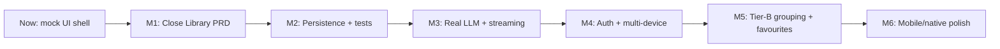

# ali-chat roadmap

Snapshot of where the project stands and the milestones we plan to ship next. No dates — milestones gate on exit criteria. Decisions get a matching ADR in [docs/adr/](adr/).

## Where we are today

- **Stack**: Next 16, React 19, Tailwind 4, TypeScript, pnpm.
- **Working UI shell** (mock data only):
  - Composer + mock model picker + optimistic send with `assistant-pending` skeleton in [hooks/use-thread-workspace.ts](../hooks/use-thread-workspace.ts).
  - Sidebar with flat history, pinned fast-tabs (DnD pin/reorder, `MAX_PINS`), context menu (rename / archive / delete dialog / share / open in new tab / export MD / export PDF).
  - Library view: Tier-A heuristic grouping in [lib/group-threads.ts](../lib/group-threads.ts), tile grid + width fader + group-detail drill-in in [components/chat/library/library-apps-view.tsx](../components/chat/library/library-apps-view.tsx).
  - Deep-link via `?thread=<id>`, theme toggle, sidebar collapse, mobile sheet.
- **Missing**: persistence, real LLM, auth, tests, ADRs, API routes, Tier-B server grouping, favourites/collections, mobile Library swipe, accessibility audit, telemetry.
- **Process scaffolding**: `.agents/skills/` (Pocock skills), `.scratch/<feature>/PRD.md` issue tracker convention per [docs/agents/issue-tracker.md](agents/issue-tracker.md), domain glossary in [CONTEXT.md](../CONTEXT.md).

## M1 — Close the Library PRD

In-flight PRD: [.scratch/chat-history-views/PRD.md](../.scratch/chat-history-views/PRD.md). Open items broken into tracer-bullet issues under [.scratch/chat-history-views/issues/](../.scratch/chat-history-views/issues/).

- Resolve the 4 open items:
  - `01-pinned-folder-regroup-rules.md` — rules when a thread leaves a pinned folder after regroup.
  - `02-touch-pin-affordance.md` — mobile drag-to-pin vs an "Add to pins" overflow item.
  - `03-library-finder-mobile-layout.md` — column stack vs horizontal scroll; fader strategy; z-index vs composer.
  - `04-library-mobile-swipe-degrade.md` — single-level fallback until Tier-B ships.
- Add unit tests for [lib/group-threads.ts](../lib/group-threads.ts) (Jaccard threshold edge cases, "New chat" non-merge) and [lib/thread-workspace-logic.ts](../lib/thread-workspace-logic.ts) (pin merge, archive/delete next-active selection).
- A11y pass on Library tiles + pin strip — verify SR labels and keyboard pin/unpin from PRD §5.

**Exit criteria**: PRD `## Open items` empty; all 4 issues closed; smoke test of pin / archive / delete / Library drill-in passes in dev.

## M2 — Persistence (web)

- Decide store: `localStorage` JSON vs IndexedDB (e.g. `idb-keyval`). ADR.
- Persist: threads, archive set, pinned ids, model id, last `mainView`. Version + migration shim.
- Keep [lib/mock-threads.ts](../lib/mock-threads.ts) as a "first-run seed" toggle.

**Exit criteria**: refresh preserves state; clear-storage UX in settings; no SSR hydration warnings.

## M3 — Real LLM + streaming

- Add `app/api/chat/route.ts` (Edge runtime). Provider behind an interface so swapping models stays local. `MOCK_MODELS` becomes `MODELS`.
- Replace `scheduleResolve` placeholder in [hooks/use-thread-workspace.ts](../hooks/use-thread-workspace.ts) with token streaming into the `assistant-pending` bubble; cancel on unmount/new send.
- Error states + retry; cost / rate-limit guardrails.

**Exit criteria**: end-to-end real reply with stream; abort works; errors surface in the bubble.

## M4 — Auth + multi-device

- Add auth (NextAuth or similar). Gate the API route; anonymous mode still works locally.
- Server-side thread store (Postgres or KV). Sync rule: server is source of truth when logged in; merge local on first login.

**Exit criteria**: log in on a second browser → same threads; logout → fall back to local.

## M5 — Tier-B grouping + favourites

- API route batches LLM / embeddings categorization; persist `folderKey`, `folderTitle`, `groupingSource: 'server'`, `lastGroupedAt`; debounce re-group on title change. Fields already typed in [lib/chat-types.ts](../lib/chat-types.ts).
- Favourites: star individual threads **and** pin whole folders (PRD §Decisions). Apply the "pinned folder regroup" rule from M1.

**Exit criteria**: server-grouped folders visible alongside heuristic ones; favourites section above flat History.

## M6 — Mobile/native polish

- Mobile Library: vertical category bands + horizontal swipe between sub-views (PRD decision).
- Touch DnD for pins, or the overflow alternative chosen in issue `02`.
- Evaluate native shell (Tauri / Capacitor / RN-Web). Persistence story expands here.

**Exit criteria**: thumb-reachable navigation; no desktop regressions.

## Cross-cutting (any milestone)

- **Tests**: Vitest + Testing Library for hooks / components; Playwright smoke per milestone.
- **Observability**: client error boundary, lightweight analytics opt-in.
- **ADRs**: one per non-trivial decision in [docs/adr/](adr/).
